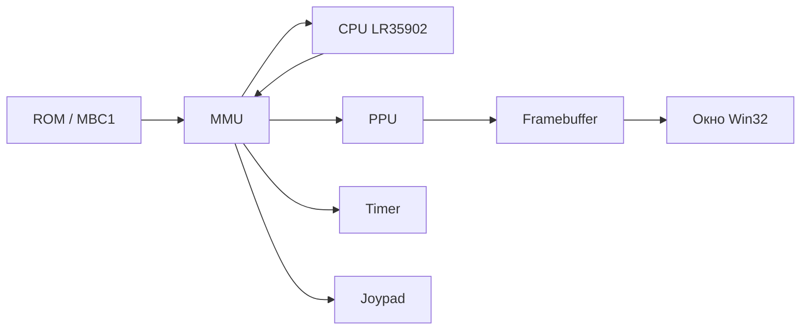
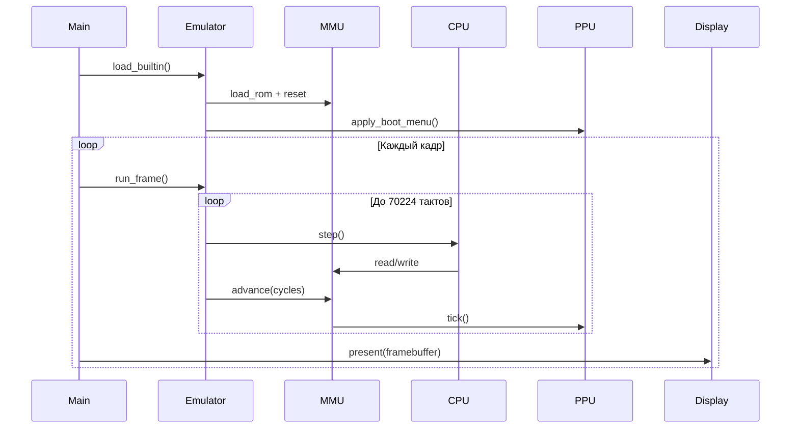

# Эмулятор Game Boy (DMG): исследование предметной области и техническое руководство

Документ описывает проект **gb-emulator** — учебный прототип эмулятора классической портативной консоли Nintendo Game Boy (модель DMG) на языке C++17.

**Цель прототипа:** показать, как из простых модулей собирается работающая система: процессор выполняет инструкции, память маршрутизирует обращения, видеочип рисует кадр, окно отображает результат.

---

## Содержание

1. [Что такое эмулятор Game Boy](#1-что-такое-эмулятор-game-boy)
2. [Последовательность исследования предметной области](#2-последовательность-исследования-предметной-области)
3. [Архитектура проекта gb-emulator](#3-архитектура-проекта-gb-emulator)
4. [Техническое руководство для начинающих](#4-техническое-руководство-для-начинающих)
5. [Сборка и запуск](#5-сборка-и-запуск)
6. [Ограничения и дальнейшее развитие](#6-ограничения-и-дальнейшее-развитие)
7. [Полезные ссылки](#7-полезные-ссылки)

---

## 1. Что такое эмулятор Game Boy

**Эмулятор** — программа, которая воспроизводит поведение другого устройства. Для Game Boy нужно смоделировать:

| Компонент | Назначение |
|-----------|------------|
| **CPU** (LR35902) | Выполняет машинный код игры |
| **Память (MMU)** | ROM, RAM, видеопамять, регистры ввода-вывода |
| **PPU** | Формирует изображение 160×144 пикселя |
| **Таймер** | Счётчик времени и прерывания |
| **Джойстик** | Состояние кнопок |
| **Картридж** | ROM-файл и (опционально) MBC — переключение банков памяти |

Один **кадр** игры длится примерно **1/59.73 секунды** и соответствует **70224 тактам** CPU.



---

## 2. Последовательность исследования предметной области

Ниже — логичный порядок действий, которым можно пользоваться при создании любого эмулятора ретро-консоли. Именно в таком духе строился **gb-emulator**.

### Этап 1. Постановка цели и границ

**Вопросы:**

- Какую модель эмулируем? (DMG — оригинальный Game Boy, без цвета GBC.)
- Нужен ли звук (APU)? (В прототипе — нет.)
- Нужны ли все игры или демо/одна игра? (Прототип + встроенное меню + опциональный ROM.)

**Решение для gb-emulator:**

- Платформа: **DMG**
- Минимум: CPU + память + фон + спрайты + таймер + джойстик + MBC1
- Запуск **без внешнего ROM** (встроенная демо-программа и графическое меню)

### Этап 2. Сбор первоисточников

Изучите документацию (в таком порядке удобнее всего):

1. **Pan Docs** — карта памяти, регистры LCD, прерывания  
   https://gbdev.io/pandocs/
2. **GBEDG** (Game Boy Emulator Development Guide) — практичные объяснения для разработчиков эмуляторов
3. **Формат ROM** — заголовок по адресу `0x0100–0x014F` (название, тип картриджа, размер ROM/RAM)
4. **Тестовые ROM** — `blargg`, `mooneye` (для проверки точности; в прототипе не подключены)

**Практика:** заведите таблицу «адрес → что там находится». Пример:

| Диапазон | Назначение |
|----------|------------|
| `0x0000–0x7FFF` | ROM (через картридж) |
| `0x8000–0x9FFF` | VRAM (тайлы, карта фона) |
| `0xC000–0xDFFF` | WRAM |
| `0xFE00–0xFE9F` | OAM (спрайты) |
| `0xFF00–0xFF7F` | I/O (LCD, таймер, джойстик) |
| `0xFF80–0xFFFE` | HRAM |
| `0xFFFF` | IE (маска прерываний) |

### Этап 3. Выбор стратегии эмуляции

| Подход | Плюсы | Минусы |
|--------|-------|--------|
| **Интерпретация CPU** (наш проект) | Понятно, гибко | Медленнее, нужно много опкодов |
| Динамическая рекомпиляция | Быстро | Сложно для учебного проекта |
| HLE (эмуляция API игры) | Очень быстро | Не подходит для точной консоли |

Для начинающих оптимален **интерпретатор**: функция «выполнить одну инструкцию → вернуть число тактов».

### Этап 4. Проектирование модулей

Разбейте систему на независимые части с узкими интерфейсами:

```
Emulator
 ├── CPU      (шаг инструкции)
 ├── MMU      (read/write по адресу)
 │    ├── Cartridge (ROM, MBC1)
 │    ├── PPU
 │    ├── Timer
 │    └── Joypad
 └── Display  (окно, опционально)
```

**Правило:** CPU не должен знать детали видеочипа — только читать/писать байт по адресу `0xFF44`.

### Этап 5. Реализация по слоям (итерации)

Рекомендуемый порядок разработки:

1. **Типы, загрузка ROM, пустой цикл**
2. **MMU** — маршрутизация ROM и RAM
3. **CPU** — базовые опкоды (`LD`, `JP`, `INC`, …)
4. **Таймер и прерывания** — чтобы игра «жила во времени»
5. **PPU** — фон, затем спрайты
6. **MBC1** — для ROM > 32 КБ
7. **Ввод и окно**
8. **Встроенная демо-ROM / меню** — чтобы проект запускался без файлов игры

### Этап 6. Верификация

- Запуск без ROM (меню)
- Запуск homebrew-ROM
- Сравнение PC, LY, регистров LCD в консоли (`--headless`)
- Позже — тестовые ROM blargg

### Этап 7. Документирование и упрощение сборки

- CMake, `build.bat`
- Встроенная ROM, Win32-окно без SDL
- Краткая инструкция для пользователя

---

## 3. Архитектура проекта gb-emulator

### 3.1. Структура каталогов

```
gb-emulator/
├── include/gb/          # Заголовки
│   ├── types.hpp        # u8, u16, размер экрана, такты кадра
│   ├── cpu.hpp          # Процессор LR35902
│   ├── mmu.hpp          # Адресное пространство
│   ├── ppu.hpp          # Видео
│   ├── cartridge.hpp    # ROM и MBC1
│   ├── timer.hpp
│   ├── joypad.hpp
│   ├── emulator.hpp     # Главный цикл
│   ├── builtin_rom.hpp  # Встроенная демо-ROM
│   ├── menu_graphics.hpp
│   └── display_win32.hpp
├── src/                 # Реализации (.cpp)
├── docs/                # Документация
├── CMakeLists.txt
├── build.bat            # Сборка под Windows
└── gb_emulator.exe        # Копируется после сборки
```

### 3.2. Главный цикл кадра

Сердце эмулятора — метод `Emulator::run_frame()`:

```cpp
bool Emulator::run_frame() {
    if (!ready()) {
        return false;
    }

    int cycles = 0;
    while (cycles < CYCLES_PER_FRAME) {  // 70224 такта
        const int used = cpu_.step();    // 1 инструкция CPU
        cycles += used;
        mmu_.advance(used);              // PPU + таймер на те же такты
    }
    return true;
}
```

Константа в `types.hpp`:

```cpp
constexpr int SCREEN_WIDTH = 160;
constexpr int SCREEN_HEIGHT = 144;
constexpr int CYCLES_PER_FRAME = 70224; // ~59.73 Hz на DMG
```

### 3.3. Поток данных при запуске



---

## 4. Техническое руководство для начинающих

Эта часть объясняет, **как с нуля собрать аналогичную технологию**, шаг за шагом.

### 4.1. Что нужно заранее

**Знания:**

- Базовый C++ (классы, `std::vector`, `std::array`)
- Понимание hex-адресов и битовых масок
- Основы CMake

**Инструменты:**

- Компилятор C++17 (Visual Studio 2022, MinGW или Clang)
- CMake 3.16+

### 4.2. Шаг 1. Базовые типы и константы

Создайте `include/gb/types.hpp`:

```cpp
#pragma once
#include <array>
#include <cstdint>
#include <vector>

namespace gb {

using u8  = std::uint8_t;
using u16 = std::uint16_t;
using u32 = std::uint32_t;

constexpr int SCREEN_WIDTH  = 160;
constexpr int SCREEN_HEIGHT = 144;
constexpr int CYCLES_PER_FRAME = 70224;

} // namespace gb
```

**Зачем:** единые имена типов и константы экрана/кадра во всём проекте.

### 4.3. Шаг 2. Картридж и загрузка ROM

ROM — двоичный файл. Первые байты содержат заголовок (название игры по адресу `0x0134`).

Минимальный интерфейс:

```cpp
class Cartridge {
public:
    void load(const std::vector<u8>& data);
    u8 read(u16 addr) const;   // addr < 0x8000
    void write(u16 addr, u8 value);
    bool loaded() const;
};
```

Чтение ROM (без MBC):

```cpp
u8 Cartridge::read(u16 addr) const {
    if (addr < 0x8000 && addr < rom_.size()) {
        return rom_[addr];
    }
    return 0xFF;
}
```

**MBC1** (упрощённо): при записи в диапазон `0x0000–0x7FFF` переключаются банки ROM; банк `0` при чтении из области `0x4000–0x7FFF` трактуется как банк `1`.

### 4.4. Шаг 3. MMU — диспетчер памяти

MMU решает, **куда** направить обращение CPU:

```cpp
u8 MMU::read(u16 addr) const {
    if (addr < 0x8000) {
        return cartridge_.read(addr);
    }
    if (addr >= 0x8000 && addr < 0xA000) {
        return ppu_.read_vram(addr);
    }
    if (addr >= 0xC000 && addr < 0xE000) {
        return wram_[addr - 0xC000];
    }
    if (addr == 0xFF00) {
        return joypad_.read();
    }
    // ... таймер, IF, IE, HRAM
    return 0xFF;
}
```

**Упражнение для начинающих:** добавьте `printf` при записи в `0xFF40` (регистр LCDC) и убедитесь, что игра включает экран.

### 4.5. Шаг 4. CPU — один шаг эмуляции

CPU хранит регистры и программный счётчик `PC`:

```cpp
struct Registers {
    u8 a{}, f{}, b{}, c{}, d{}, e{}, h{}, l{};
    u16 sp{};
    u16 pc{};
    // флаги Z, N, H, C в регистре F
};
```

Один шаг:

```cpp
int CPU::step() {
    // 1. Обработать прерывания, если IME включён
    // 2. Если HALT — ждать прерывание
    const u8 opcode = mmu_.read(regs_.pc++);  // fetch
    return execute(opcode);                  // decode + execute, вернуть такты
}
```

Пример простой инструкции **LD A, n** (загрузить байт в A):

```cpp
// Опкод 0x3E: LD A, d8
case 0x3E: {
  regs_.a = mmu_.read(regs_.pc++);
  return 8;  // длительность в тактах
}
```

Пример **JP nn** (безусловный переход):

```cpp
// Опкод 0xC3: JP a16
case 0xC3: {
  const u8 lo = mmu_.read(regs_.pc++);
  const u8 hi = mmu_.read(regs_.pc++);
  regs_.pc = static_cast<u16>((hi << 8) | lo);
  return 16;
}
```

**Совет:** сначала реализуйте 20–30 самых частых опкодов, затем расширяйте. В gb-emulator реализован большой набор в `cpu.cpp`.

После сброса DMG типичное состояние:

```cpp
regs_.pc = 0x0100;
regs_.sp = 0xFFFE;
// A=0x01, B=0x00, C=0x13, ... (см. Pan Docs "Power Up Sequence")
```

### 4.6. Шаг 5. PPU — отрисовка фона

PPU каждые **456 тактов** продвигает состояние LCD (строка `LY`, режим OAM/VRAM/HBlank/VBlank).

Упрощённая логика на одну scanline:

1. Если LCD выключен — ничего не рисовать
2. Для каждого пикселя X на строке `LY`:
   - Взять тайл из **tile map** (`0x9800` или `0x9C00`)
   - Прочитать пиксель из **tile data** (`0x8000` или `0x8800`)
   - Применить палитру BGP → индекс цвета 0–3
   - Записать в `framebuffer_[LY * 160 + X]`

Чтение пикселя внутри тайла 8×8:

```cpp
u8 read_tile_pixel(u16 tile_addr, int x, int y) const {
    const u16 line = tile_addr + y * 2;
    const u8 low  = vram_[line];
    const u8 high = vram_[line + 1];
    const int bit = 7 - x;
    return static_cast<u8>(((high >> bit) & 1) << 1 | ((low >> bit) & 1));
}
```

**Спрайты:** объекты в OAM по 4 байта (Y, X, тайл, флаги). На каждой строке — до 10 спрайтов, отрисовка поверх фона с учётом приоритета.

### 4.7. Шаг 6. Таймер и джойстик

**Таймер:** регистры `DIV` (`0xFF04`), `TIMA`, `TMA`, `TAC`. При переполнении `TIMA` — прерывание (бит 2 в `IF`).

**Джойстик:** регистр `0xFF00`. Кнопки активны по низкому уровню при выборе строки/столбца матрицы.

```cpp
void Joypad::press(u8 button) {
    buttons_ &= static_cast<u8>(~(1u << button));
}
```

Связь с окном: при нажатии клавиши в Win32 вызывайте `mmu.joypad_interrupt()` (установить бит 4 в `IF`).

### 4.8. Шаг 7. Класс Emulator

Объедините всё в один фасад:

```cpp
class Emulator {
    MMU mmu_;
    CPU cpu_{mmu_};
public:
    void load_builtin();
    bool load_rom_file(const std::string& path);
    void reset();
    bool run_frame();
    const auto& framebuffer() const { return mmu_.ppu().framebuffer(); }
};
```

### 4.9. Шаг 8. Встроенная ROM и меню (без файла игры)

Чтобы проект запускался «из коробки»:

1. **`builtin_rom.cpp`** — массив 32 КБ с заголовком картриджа и короткой программой (`HALT` после включения LCD).
2. **`menu_graphics.cpp`** — запись тайлов и карты фона в VRAM: надписи GAME BOY, кнопки START/OPTIONS.

Вызов после сброса:

```cpp
void Emulator::load_builtin() {
    mmu_.load_rom(builtin_rom());
    reset();
    mmu_.ppu().apply_boot_menu();
}
```

Фрагмент построения ROM (заголовок + переход на код):

```cpp
rom[0x100] = 0x00;             // NOP
rom[0x101] = 0xC3;             // JP
rom[0x102] = 0x50;
rom[0x103] = 0x01;             // адрес 0x0150

rom[0x150] = 0x3E; rom[0x151] = 0x91; // LD A, 0x91
rom[0x152] = 0xE0; rom[0x153] = 0x40; // LDH (LCDC), A
rom[0x154] = 0x76;                   // HALT
```

### 4.10. Шаг 9. Окно Win32 (без SDL)

На Windows можно вывести framebuffer через GDI:

1. `CreateWindow` — окно
2. `CreateDIBSection` — буфер 160×144 RGB
3. Каждый кадр: скопировать `framebuffer` → `StretchBlt` на окно

Главный цикл в `main.cpp`:

```cpp
while (display.poll(emu)) {
    emu.run_frame();
    display.present(emu.framebuffer());
    Sleep(16);  // ~60 FPS
}
```

---

## 5. Сборка и запуск

### Windows (рекомендуется)

```cmd
cd путь\к\gb-emulator
build.bat
```

Или вручную:

```cmd
cmake -B build
cmake --build build --config Release
gb_emulator.exe
```

### Аргументы

| Команда | Действие |
|---------|----------|
| `gb_emulator.exe` | Встроенное меню, окно |
| `gb_emulator.exe game.gb` | Внешний ROM |
| `gb_emulator.exe --headless` | Консоль, без окна |

### PowerShell

Если скрипты заблокированы:

```powershell
.\build.bat
```

(не `build.ps1` без изменения политики выполнения)

---

## 6. Ограничения и дальнейшее развитие

Текущий прототип **не претендует на 100% совместимость** со всеми играми.

| Реализовано | Не реализовано / упрощено |
|-------------|---------------------------|
| Большой набор опкодов CPU | Не все тайминги и corner cases |
| Фон + спрайты | Окно (Window layer) |
| MBC1 (базово) | MBC3, MBC5, RTC |
| Таймер, прерывания | APU (звук) |
| Win32-окно | Точный cycle-accurate PPU |
| Встроенное меню | OAM DMA, Serial |

**Разумные следующие шаги:**

1. Тесты blargg (`cpu_instrs`, `instr_timing`)
2. APU (канал square1 / noise)
3. Window layer и точный PPU
4. SDL2 для кроссплатформенного окна
5. Сохранения (батарейная RAM в MBC)

---

## 7. Полезные ссылки

| Ресурс | URL |
|--------|-----|
| Pan Docs | https://gbdev.io/pandocs/ |
| Awesome Game Boy | https://github.com/gbdev/awesome-gb |
| GBEDG | Поиск «Game Boy Emulator Development Guide» |
| Тестовые ROM | https://github.com/c-sp/gameboy-test-roms |

---

## Краткое резюме

1. **Исследуйте** карту памяти и компоненты консоли до написания кода.
2. **Делите** эмулятор на CPU, MMU, PPU и периферию.
3. **Связывайте** их через `read`/`write` по адресу и главный цикл «такт → инструкция → advance».
4. **Проверяйте** по шагам: ROM грузится → PC растёт → появляется картинка.
5. **gb-emulator** — рабочий каркас с меню, MBC1, спрайтами и сборкой под Visual Studio 2022.

Удачи в разработке эмуляторов.
